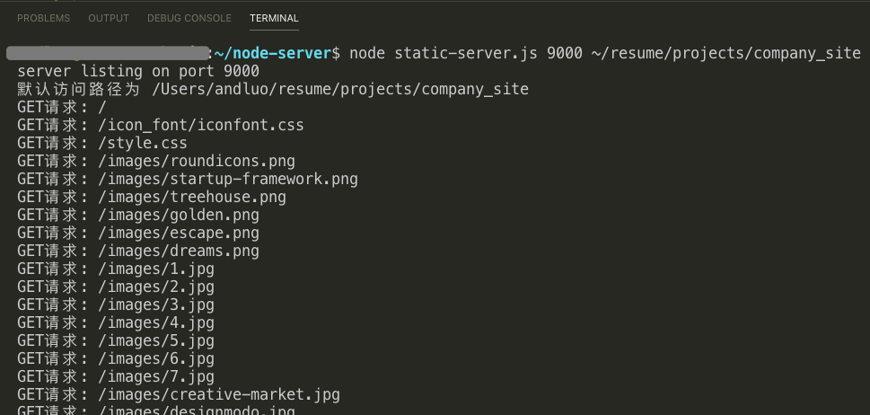
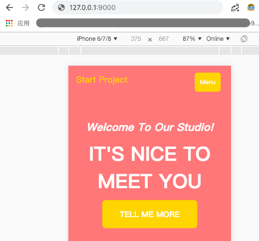

# node-server
使用ES6实现一个Node.js静态文件服务器

## 目的
1. 主要是用来自己学习
2. 搭建后可以给自己日常使用

## 使用方式
1. 下载`static-server.js`到本地

2. 进入`static-server.js`所在目录

3. 执行`node static-server.js` 即会把当前目录当作静态服务器的根目录，端口号默认为 `9000`

    - 或者执行 `node static-server.js 8080 ～/test` 则会把当前用户下的`test`目录当前服务器的根目录，端口号为`8080`

4. 访问`127.0.0.1`即会访问 `127.0.0.1/index.html`

